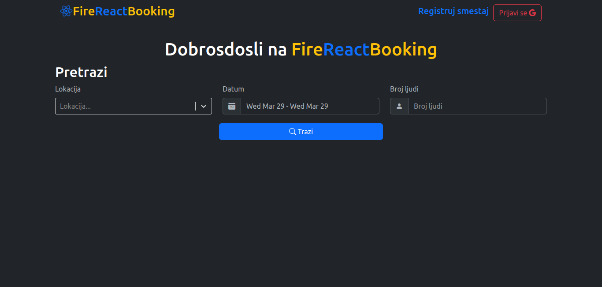
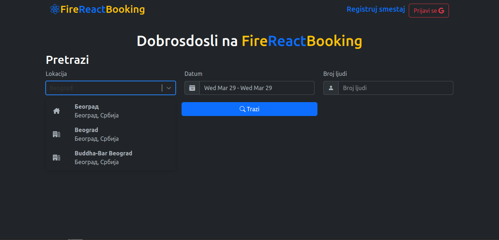
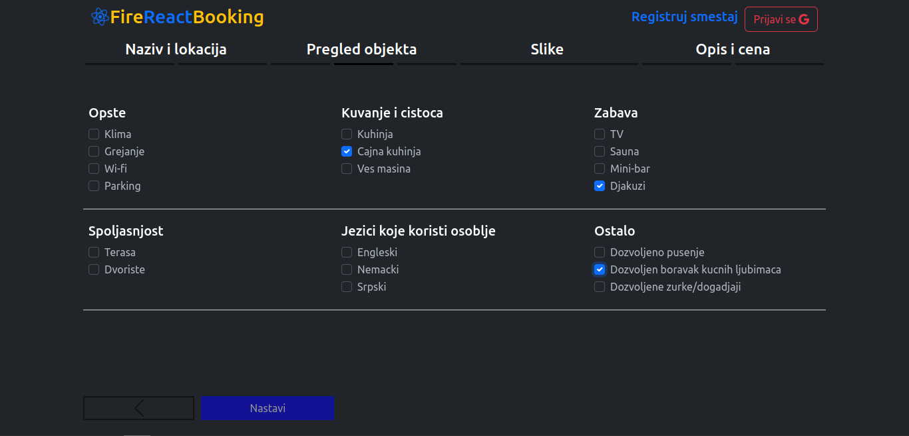
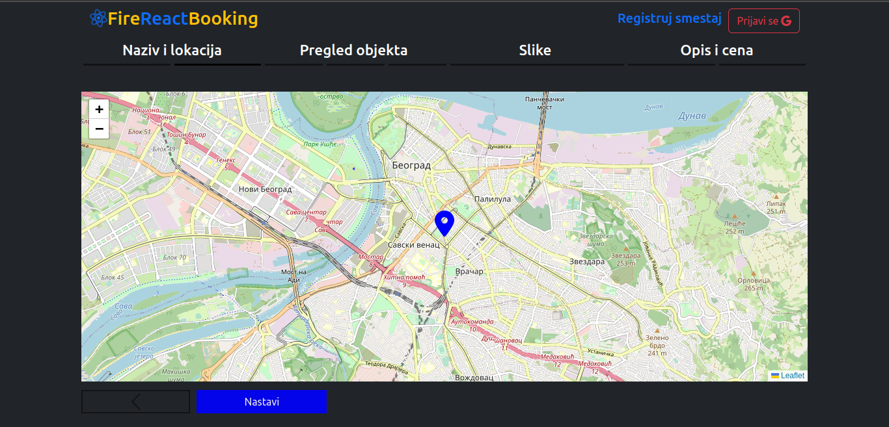
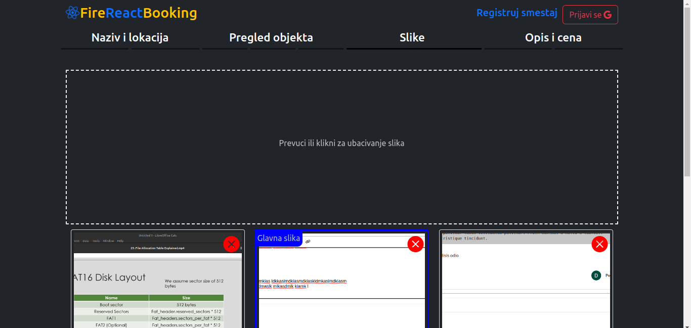
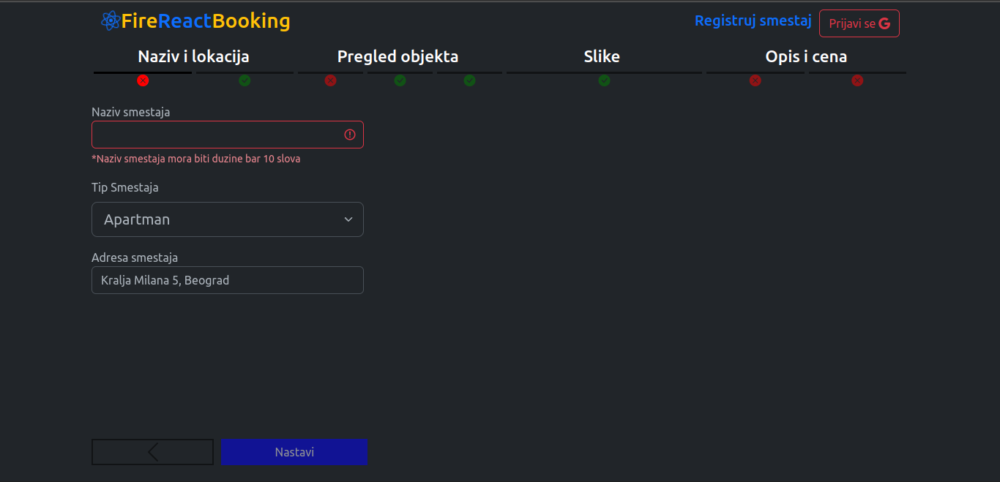
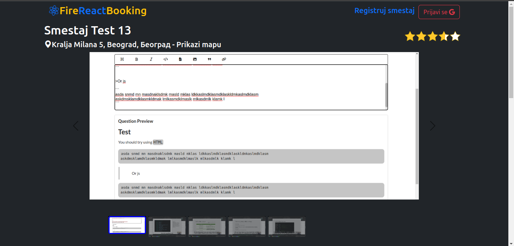
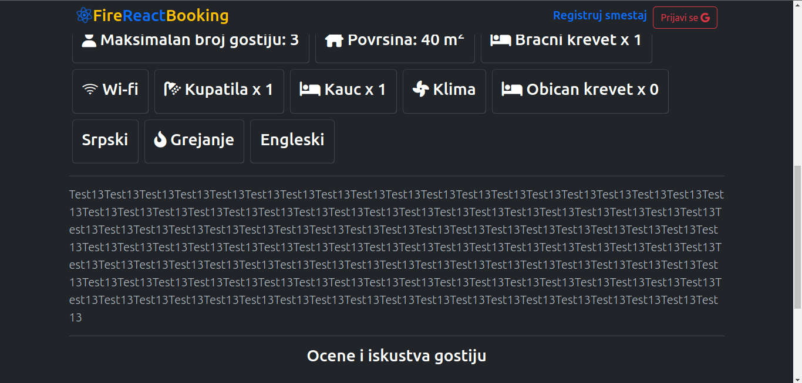
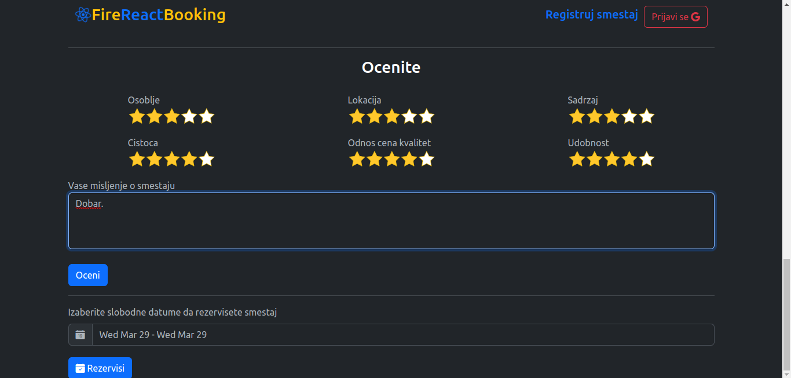
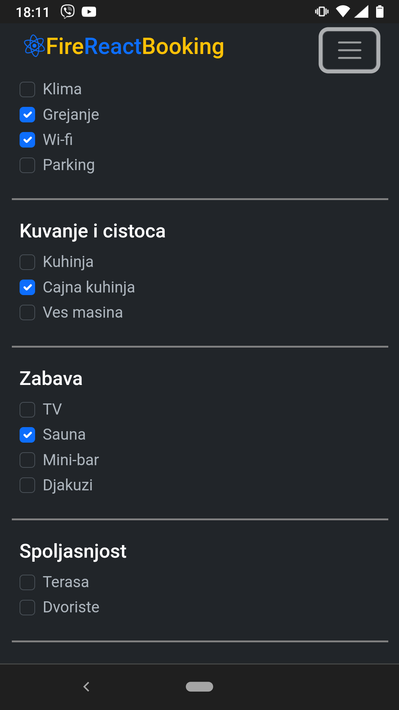

# FireReactBooking

This web app is copy of *Booking.com* web app bulit using `React` and `Firebase`.

It is hosted on https://firestart-33783.web.app/

It has functionalities to search for rooms on any location using `geoapify` api for geocoding, address autocomplition and reverse geocoding, and also 
searching in certain period (choosing start and end date of room rent). Then user can then choose the room from the displayed list of the search and see 
photos and details about the room. It can also reserve a room and send his review of the room. Also user can register new rooms...

### Searching rooms

> Location select using `geoapify` api

> Search on search page

### Form for registering new room

> Setting geolocation of room 

> Choosing pictures of room

> Validation of form

### Get info about the room

> Description and gadets of room

> Reservation and review of room

### Responsivness

There is lot of things that can be improved such as: 
1. Implementing search that takes number of people into count
2. Sending feedback about sending review and reservation (for example using react toastify)
3. Repair PeriodInput component toogleness
4. Implement aproving of reservation and setting that only those users that viseted room can send review...
5. Improve styling
6. And more...

